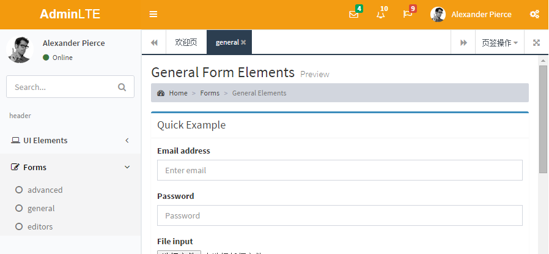
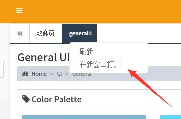

## Introduction(简介)

基于AdminLTE框架,并且集成了iframe的tab页面和对应的交互关系实现,是一款适合中国国情的后台主题UI框架

## 快速上手
   下载后 直接访问  你的项目目录/pages/index_iframe.html  即可看到效果
写的仓促 左侧菜单和tabs交互只支持2级，以后有时间升级到无限级
## 目录结构
- build/js/iframe 存放所有关于iframe的源代码，强烈建议修改这里的代码
- dist/js/app_iframe.js 使用grunt构建工具生成的js，属于打包后的js




## 1. branch(分支)

更新分支为master

## 2. reference(参考)

**[super ui](https://github.com/tzhsweet/superui)**

(iframe功能的js和页面css都是参考superui得出来的)

## 3. Installation(安装)

修改可以使用grunt构建工具

- 安装nodejs
- 项目根目录下命令行执行
- npm install grunt-cli -g
- npm install

## 4. 目录结构
- build/js/iframe 存放所有关于iframe的源代码，强烈建议修改这里的代码
- dist/js/app_iframe.js 使用grunt构建工具生成的js，属于打包后的js

## 5. Documentation(文档)

(请阅读源码进行修改)  

[AdminLTE官方文档](http://weituotian.oschina.io/adminlte-with-iframe/documentation/index.html)


### 5-1. 整合到您的项目
1. 负责 `plugins`, `dist` 目录到您的项目中
1. 复制 [index_iframe.html](pages/index_iframe.html) 到您的项目中，
    1. 修改引用的js路径，css路径，比如Java Web要用到${ContextPath}之类的。
    1. 也可修改其中的创建菜单的js
1. 子iframe的页面可以复制模板 [welcome_iframe.html](pages/welcome_iframe.html)


### 5-2. iframe框架

介绍一些集成了iframe后新增的功能，和修改方法。
请确认执行完上面文档的安装部分。
可随时开启issue.

#### 5-2-1. 选项卡右键菜单，双击刷新



* 修改右键菜单的文字，请参阅 [bootstrap-tab.js](build/js/iframe/bootstrap-tab.js) ，内有`context.attach`初始化json菜单，并且可以参考其获取特定tab当前url的代码
* 刷新选项卡刷新当前tab页，bootstrap-tab.js中的`$tabs.on("dblclick",`绑定了双击事件。可注释取消这个功能

#### 5-2-2. 一些配置

在 [index_iframe.html](pages/index_iframe.html) 中：

```
//设置根目录，
//当前实际的开发中一般用不到
//比如你的首页用到index_iframe.html这个模版，访问地址为http://localhost/，就不用设置了
//如果你部署在http://localhost/xxx, xxx是你部署的路径，那么就按以下代码设置一下根目录
App.setbasePath("../");

//设置图片路径，相对于根目录
//这个框架带有一些图片（加载进度条等），你可以放置在其它地方
//但要如下设置，
//比如在本项目中，引用的图片放在了根目录下，dist/img/中
App.setGlobalImgPath("dist/img/");

```
#### 5-2-3. tab的操作

所有的操作都可以在index_iframe.html中实现。index_iframe.html作为一个父页面承载了许多iframe。以下介绍的函数可以主页面使用, 在iframe子页面，也可以通过`top.xxx`来调用父页面的函数。
以下函数可以打开chrome控制台进行测试操作。

##### 5-2-3-1. 增加新tab
动态增加菜单，你可以从后台读取菜单，用以下的json格式封装。同时还可以自己额外增加菜单
```
//欢迎页的菜单。
        addTabs({
            id: '10008',
            title: '欢迎页',
            close: false,
            url: 'welcome_iframe.html',
            urlType: "relative"
        });
```

- **id** 代表这个tab的id，重复id将认为同一个tab，如果你从数据库读取菜单，那么可以设置该id为数据库中菜单的id
- **title** 选项卡的标题
- **close**　false表示不可以关闭
- **url** 指定一个url地址，绝对或者相对地址
- **urlType** 可选relative和absolute ,默认是relative, 相对于当前页面（管理所有tab的页面）
比如`http://localhost/index.html`,想打开index.html同级目录UI下的页面，就给`url:UI/welcome.html;urlType:relative`

##### 5-2-3-2. 获得当前激活的tab的id
```
var pageId = getActivePageId();
```
最常用吧，一般这个就够了, 在子iframe页面用`top.getActivePageId()`获取,以下的函数类同。
有了pageId，我们可以调用其它函数操作page。

##### 5-2-3-3. 获得当前激活的tab的id

```
var pageId = getPageId(element);
```


element一般是tab栏的a超链接元素，jq对象和普通的dom都可以

##### 5-2-3-4. 根据pageId获得当前选项卡的标题
```
var title = findTabTitle(pageId);
```


##### 5-2-3-5. 根据pageId获得当前iframe

```
var $iframe = findIframeById(pageId);
```
这个iframe是一个jq对象

##### 5-2-3-6. 根据pageId获得当前panel

```
var $panel=findTabPanel(pageId)
```
这个panel是一个div，装有iframe，jq对象

##### 5-2-3-7. 关闭tab

```
closeTabByPageId(pageId);
```
pageId是你创建tab时候的id. 只要知道你要操作的pageId，也可以在一个子iframe页面关闭另外一个子iframe页面。

##### 5-2-3-8. 刷新tab
```
refreshTabById(pageId)
```
只要知道pageId，就可以刷新任何tab

## 6. Browser Support(浏览器支持)

- IE 9+
- Firefox (latest)
- Chrome (latest)
- Safari (latest)
- Opera (latest)

<a id="7-license"></a>
## 7. License

开源
